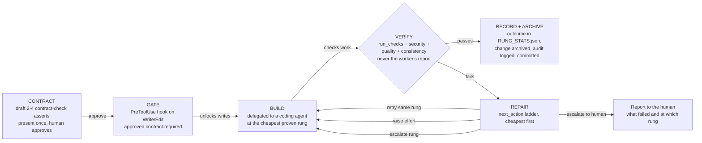
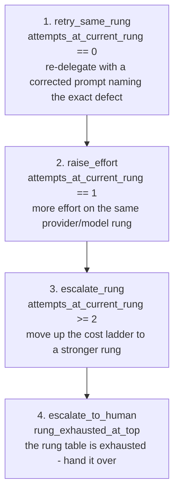
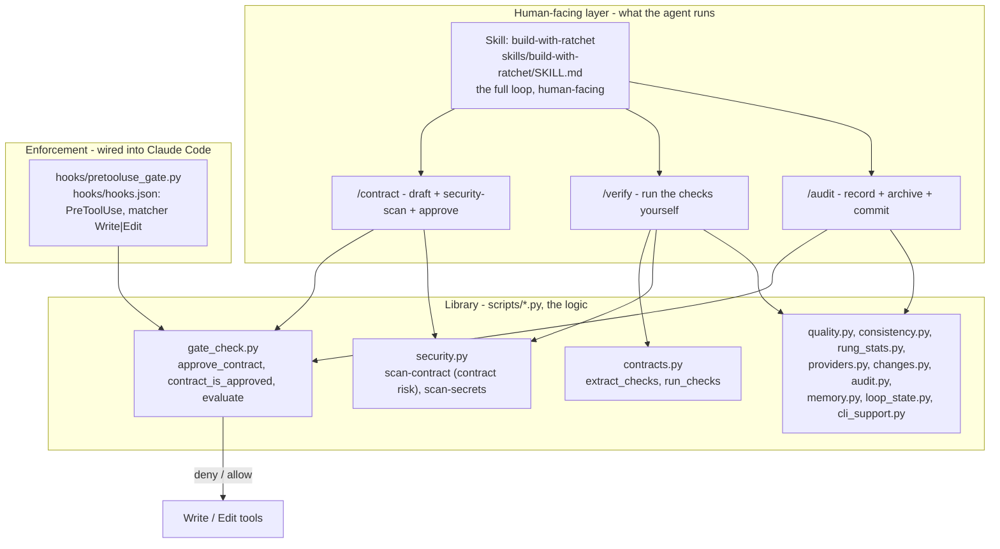
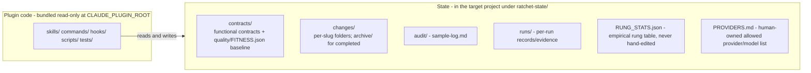

# Ratchet — Architecture

This document explains what Ratchet does and how its pieces fit together, without requiring you
to read the source. Everything here is grounded in the actual code in this repo — the scripts in
`scripts/*.py`, the hook in `hooks/pretooluse_gate.py`, and the instructions in
`skills/build-with-ratchet/SKILL.md` and `commands/*.md`.

## 1. The problem it solves

Coding agents are good at doing what they're told, but their own reports are not evidence: an
agent will happily tell you it finished, even when the result is subtly wrong, insecure, or
inconsistent with the rest of the project. Handing an agent a goal and trusting its summary is a
single point of failure.

Ratchet replaces that trust with a **contract-verified, gated build loop**:

1. The plain-language goal is turned into an **executable contract** — 2–4 `contract-check`
   blocks of real Python `assert` statements that define what "done" means, drafted by the agent
   and approved by the human in a single dense pass.
2. Write/Edit capability is **gated** on that contract being approved: a `PreToolUse` hook denies
   `Write` and `Edit` until an approved contract exists.
3. The build is delegated, then **verified against the contract and the security, quality, and
   consistency gates** — by the orchestrator itself, never against the worker's own report.
4. Success is **recorded and archived** so the next task starts from measured evidence rather than
   vibes.

Because the contract is executable Python, "does it pass?" is answered by running the code, not
by asking anyone.

## 2. The loop



### The repair ladder

When verification fails, the agent does not guess. `scripts/loop_state.py`'s `next_action()`
decides the next step, cheapest remedy first. It is only defined once the task is in
`repairing` status (or `done`):



Steps 1–3 return to **BUILD** with a corrected prompt — never a vague retry. Step 4 terminates
the loop: the agent reports to the human exactly what failed and at which rung. A task that
reaches `done` status maps to `mark_done`.

## 3. Component layout

Two separate entry paths drive the same library:

- **The skill and commands** are what the agent runs conversationally — they drive the loop by
  calling the scripts.
- **The hook** is enforcement wired into Claude Code itself: on every `Write`/`Edit` it calls
  `gate_check.evaluate()` and denies the tool when no approved contract covers the write — this
  works regardless of whether anyone used the skill or commands.



The scripts split roughly into two groups:

- **`main()` CLI entry points** — `gate_check.py`, `security.py`, and `memory.py` can be shelled
  out to directly. They print a JSON decision and exit `0` on `allow`, `1` on `deny`
  (`cli_support.emit_decision`).
- **Library-only modules** — `contracts.py`, `quality.py`, `consistency.py`, `rung_stats.py`,
  `providers.py`, `changes.py`, `audit.py`, `loop_state.py`, `cli_support.py` — are imported and
  called either from the CLI scripts or from agent-invoked `PYTHONPATH=... python3 -c`/heredoc
  calls.

### Code vs state

The plugin code is **bundled read-only** at the plugin install location (`CLAUDE_PLUGIN_ROOT`)
and is never edited; nothing is copied into your project. All contract/change/audit **state**
lives in the *target project* being worked on, under `ratchet-state/` at the project root:



Ownership rules that keep the two sides honest:

- **Never edit plugin code** — if a behavior needs changing, that's a change to this repo, not to
  a project's copy. The bundled copy is the only copy.
- **`RUNG_STATS.json` is never hand-edited** — it fills in empirically as tasks complete, via
  `rung_stats.record_outcome()`.
- **`PROVIDERS.md` is human-owned** — it is the allow-list (provider/model table, `Allowed` column)
  the rung selector is constrained by.
- The hook locates state via `CLAUDE_PROJECT_DIR` (with a `cwd` fallback) and honors
  `RATCHET_CONTRACTS_DIR` / `RATCHET_CHANGES_DIR` overrides (used by the test suite to isolate
  from real project state).

## 4. End-to-end walkthrough of `/build-with-ratchet`

This is the skill's flow, mapped onto the diagrams above. The human touchpoint is exactly one
dense message; everything else is driven by the agent.

**1. Resolve the target** (→ `CONTRACT`). Find or create `ratchet-state/` in the project being
worked on. First use is a one-liner:

```bash
mkdir -p ratchet-state/contracts ratchet-state/changes ratchet-state/audit ratchet-state/runs
```

**2. Understand the goal.** At most one clarifying round. If the goal is bigger than 2–4 checks
can honestly cover, it is decomposed into an ordered list of smaller named changes and the skill
runs once per change.

**3. Draft the contract.** The agent writes 2–4 ` ```contract-check ` fenced blocks — real Python
`assert` statements, the same convention `scripts/contracts.py` executes. Greenfield work goes to
`ratchet-state/contracts/functional/<domain>.md`; a change to an existing domain scaffolds a
change folder first (`changes.new_change()` → `proposal.md`, `contract-delta.md`, `tasks.md`) and
writes the delta there. The human never writes a check block.

**4. Present once, get one approval.** The agent shows a plain-English line per check *plus* the
actual code, and asks one question: "Does this match what you want?" No implicit or partial
approval; revise and re-present if needed.

**5. Approve → the gate opens** (→ `GATE`). Two things happen on approval:

- `security.py scan-contract` scans every check block for patterns dangerous to run unreviewed
  (the blocks get `exec()`'d on every approval and verify run). A HIGH-severity finding denies
  approval outright; MEDIUM findings (e.g. a hardcoded-secret-shaped literal, an outbound network
  call) are surfaced for the human to judge but do not block.
- `gate_check.approve_contract()` writes a `.approved-sha256` sidecar next to the contract file
  containing the contract's current SHA-256 hash. The gate considers a contract approved only if
  the sidecar exists **and** matches the contract's current hash — editing a contract after
  approval silently revokes its approval.

From then on, the `PreToolUse` hook calls `gate_check.evaluate()` on every `Write`/`Edit` and
denies the tool until an approved contract covers the write. Denials carry a `systemMessage`
explaining why. (With per-change scoping, every *active* change folder must have its **own**
approved contract, matched by filename stem — one approval can't cover later uncontracted changes.)

**6. Pick a rung and delegate** (→ `BUILD`). `rung_stats.lookup_starting_rung()` returns the
cheapest *allowed* (provider, model) pair with a pass rate ≥ 0.8 for this task class, from
`RUNG_STATS.json` × `PROVIDERS.md`. Cold start returns `None` — then the agent picks the cheapest
allowed provider/model from `PROVIDERS.md` itself, never asking the human. The build is delegated
(e.g. `/use-coding-agent`) with the acceptance check spelled out: `contracts.run_checks` on the
contract path must return `{"passed": true, "failures": []}`.

**7. Verify yourself** (→ `VERIFY`). The worker's report is never evidence. The agent runs, on
the actual state:

- **Functional:** `contracts.run_checks()` — executes each `contract-check` block independently
  in a fresh namespace, so one failure is recorded without hiding the others; returns
  `{"passed": ..., "failures": [...]}`.
- **Security:** `security.py scan-secrets` on every changed file — mandatory and never sampled
  (no audit sampling applies here). Patterns include AWS/GitHub/Stripe/Google credential shapes
  and generic assigned-secret assignments.
- **Quality:** `quality.check_ratchet(quality.compute_scores(changed_files), baseline)` — average
  cyclomatic complexity and duplicate-line count compared against the `quality/FITNESS.json`
  baseline (higher is worse). No baseline yet → check passes and the caller should save one.
- **Consistency:** `consistency.nonconforming_names(changed_files)` — function names that violate
  the dominant naming convention mined from the codebase itself (snake_case majority).

The agent also reads the actual diff — a passing contract proves the contract held, not that the
diff is sane.

**8. On failure, follow the repair order** (→ `REPAIR`). `loop_state.next_action()` returns
`retry_same_rung` → `raise_effort` → `escalate_rung` → `escalate_to_human`, and steps 1–3 loop
back to a *corrected* delegation naming the exact defect found. Escalation to human ends the loop
with a plain-language report of what failed and at which rung.

**9. On success, record, archive, audit — then report** (→ `RECORD + ARCHIVE`):

- `rung_stats.record_outcome()` appends the real measured pass/fail, cost, and latency to the
  matching `(task_class, provider, model)` entry in `RUNG_STATS.json` — unknown cost/latency is
  recorded as `0.0` explicitly, never invented.
- `changes.archive_change()` moves the scaffolded change folder to `changes/archive/<date>-<slug>`
  (which also makes the gate treat it as no longer active).
- `audit.sample_rate()` + `audit.should_sample()` + `audit.log_sample_decision()` append a
  deterministic, reproducible sampling decision to `audit/sample-log.md` — the sample rate falls
  with consecutive clean passes and rises with risk flags; security checks are exempt from
  sampling entirely.
- The agent commits (`git add` + `git commit`, including the updated `ratchet-state/` files) and
  reports in plain language: what got built, which contract it satisfies, what it cost, the audit
  decision, and the commit.

**10. Next task.** A fresh session starts from the accumulated state: measured rung evidence in
`RUNG_STATS.json`, the human-owned provider allow-list in `PROVIDERS.md`, archived change history,
and (optionally) advisory instincts from `memory.py` — recalled context that is explicitly the
weakest evidence tier and never gates anything.

## Reference: where each piece of behavior lives

| Behavior | Code |
|---|---|
| Contract format + execution (`contract-check` blocks) | `scripts/contracts.py` |
| Approval (`-approved-sha256` sidecar) and gate decision | `scripts/gate_check.py` |
| PreToolUse enforcement on Write/Edit | `hooks/pretooluse_gate.py`, `hooks/hooks.json` |
| Secret scanning + contract-risk scanning | `scripts/security.py` |
| Quality baseline comparison | `scripts/quality.py` |
| Naming-convention conformance | `scripts/consistency.py` |
| Rung table: record outcomes, pick cheapest proven rung | `scripts/rung_stats.py` |
| Provider allow-list parsing | `scripts/providers.py` |
| Change scaffolding + archiving | `scripts/changes.py` |
| Audit sampling | `scripts/audit.py` |
| Repair-order decision procedure | `scripts/loop_state.py` |
| Advisory session-crossing memory (never gates) | `scripts/memory.py` |
| JSON decision / exit-code plumbing for CLI scripts | `scripts/cli_support.py` |
